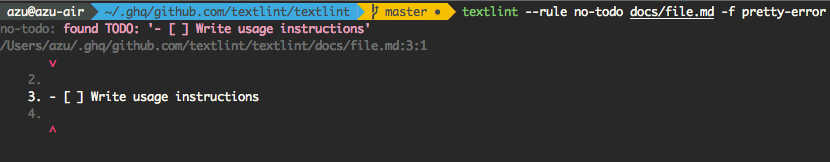
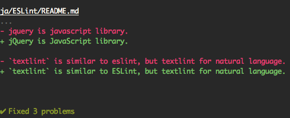

# textlint

[](http://textlint.github.io/)

> The pluggable linting tool for text and markdown.  
> It is similar to [ESLint](http://eslint.org/ "ESLint"), but textlint for natural language.

[](https://travis-ci.org/textlint/textlint)

## Online Demo

Visit [https://textlint.github.io/](https://textlint.github.io/) and type text!

## Features

- No bundle rules.
- To use rule, run simply `npm install textlint-rule-xxx`. See a [collection of textlint rules](https://github.com/textlint/textlint/wiki/Collection-of-textlint-rule "Collection of textlint rule · textlint/textlint Wiki")
- [Markdown](https://github.com/textlint/textlint-plugin-markdown) and [plain text](https://github.com/textlint/textlint-plugin-text ) are support by default. Additionally, [HTML](https://github.com/textlint/textlint-plugin-html) and other formats are supported by plugins.
- [Formatter(reporter)](https://github.com/textlint/textlint-formatter) is used both by bundled and custom formatters

## Quick Tour

Quick tour of textlint!

Read [Getting Started](./docs/getting-started.md) :squirrel:

## Installation

```
$ npm install textlint -g
```

## Usage



textlint has no default rule!!

Use textlint with `--rule` or `--rulesdir`, `.textlintrc` config file.

```sh
# Install textlint's rule
npm install --save-dev textlint-rule-no-todo
```

Use with `textlint-rule-no-todo` rule.
(allow to short `textlint-rule-no-todo` to `no-todo`)

```sh
textlint --rule no-todo README.md
```

## CLI

See command help.

```
$ textlint -h
textlint [options] file.md [file.txt] [dir]

Options:
  -h, --help                 Show help.
  -c, --config path::String  Use configuration from this file or sharable config.
  --plugin [String]          Specify plugins
  --rule [path::String]      Set rule package name
  --preset [path::String]    Set preset package name and load rules from preset package.
  --rulesdir [path::String]  Set rules from this directory and set all default rules to off.
  -f, --format String        Use a specific output format.
  --fix                      Automatically fix problems
  --debug                    Output debugging information
  --dry-run                  Enable dry-run mode for --fix. Only show result, don't change the file.
  -v, --version              Outputs the version number.
  --no-color                 Disable color in piped output.
  -o, --output-file path::String  Enable report to be written to a file.
  --init                     Create the config file if not existed. - default: false
  --quiet                    Report errors only. - default: false

Experimental:
  --experimental             Enable experimental flag.Some feature use on experimental.

Using stdin:
  --stdin                    Lint text provided on <STDIN>. - default: false
  --stdin-filename String    Specify filename to process STDIN as
```

Allow to use with multiple rules.

```sh
$ textlint --rule no-todo --rule very-nice-rule README.md
```

Example:

- :information_source: See [examples/cli](examples/cli)

### .textlintrc

`.textlintrc` is config file that is loaded as JSON, YAML or JS via [MoOx/rc-loader](https://github.com/MoOx/rc-loader "MoOx/rc-loader").

```
$ textlint --rule no-todo --rule very-nice-rule README.md
```

is equal to create `.textlintrc` file

```json
{
  "rules": {
    "no-todo": true,
    "very-nice-rule": true,
  }
}
```

and run `textlint` command

```sh
$ textlint README.md
# Automatically load `.textlintrc` in current directory
```

`.textlintrc` can define rule's option.

```json
{
  "rules": {
    "no-todo": false, // disable
    "very-nice-rule": {
        "key": "value"
    }
  }
}
```

Pass rule's options("key": "value") to `very-nice-rule`.

It mean that use the following format:

```js
{
  // Allow to comment in JSON
  "rules": {
    "<rule-name>": true | false | object
  }
}
```

:information_source: for more details

- [docs/configuring](docs/configuring.md)
- [examples/config-file](examples/config-file)

### Plugin

textlint plugin is a set of rules and rulesConfig or customize parser.

To enable plugin, put the "plugin-name" into `.textlinrc`.

```js
// `.textlinrc`
{
    "plugins": [
        "plugin-name"
    ],
    // overwrite-plugins rules config
    // <plugin>/<rule>
    "rules": {
        "plugin-name/rule-name" : false
    }
}
```

:information_source: See [docs/plugin.md](docs/plugin.md)

#### Support file format

textlint support Markdown and plain text by default.

Install **Processor Plugin** and add new file format support.
If you want to use textlint for HTML, use [textlint-plugin-html](https://github.com/textlint/textlint-plugin-html "textlint-plugin-html") as plugin.

    npm install textlint-plugin-html
    
and Add "html" to `.textlintrc`

```
{
    "plugins": [
        "html"
    ]
}
```

Lint `.html` file!

- Example : [examples/html-plugin](examples/html-plugin)
- Document: [docs/plugin.md](docs/plugin.md)

Optional supported file types:

- HTML: [textlint-plugin-html](https://github.com/textlint/textlint-plugin-html "textlint-plugin-html")
- reStructuredText: [textlint-plugin-rst](https://github.com/jimo1001/textlint-plugin-rst "textlint-plugin-rst")
- [AsciiDoc](http://www.methods.co.nz/asciidoc/)/[Asciidoctor](http://asciidoctor.org/):[textlint-plugin-asciidoc-loose](https://github.com/azu/textlint-plugin-asciidoc-loose "textlint-plugin-asciidoc-loose")
- [Re:VIEW](https://github.com/kmuto/review): [textlint-plugin-review](https://github.com/orangain/textlint-plugin-review "textlint-plugin-review")

See [Processor Plugin List](https://github.com/textlint/textlint/wiki/Collection-of-textlint-rule#processor-plugin-list "Processor Plugin List") for details.


### Rule list - [Collection of textlint rule](https://github.com/textlint/textlint/wiki/Collection-of-textlint-rule "Collection of textlint rule · textlint/textlint Wiki")

See [A Collection of textlint rule · textlint/textlint Wiki](https://github.com/textlint/textlint/wiki/Collection-of-textlint-rule "Collection of textlint rule · textlint/textlint Wiki").

If you create new rule, and add it to the wiki :)

### Fixable

[](https://textlint.github.io/) 

Some rules are fixable using the `--fix` command line flag.

``` sh
$ textlint --fix README.md
# As a possible, textlint fix the content.
```



Also, support [dry run](https://en.wikipedia.org/wiki/Dry_run_(testing) "dry run") mode.

```
$ textlint --fix --dry-run --formatter diff README.md
# show the difference between fixed content and original content.
```

### Built-in formatters

Currently, you can use "stylish" (defaults), "compact", "checkstyle", "jslint-xml", "junit", "tap", "table", "pretty-error", "json", "unix".

e.g.) use pretty-error.js

```
$ textlint -f pretty-error file.md
```

More detail in [textlint/textlint-formatter](https://github.com/textlint/textlint-formatter "textlint/textlint-formatter").

## Use as node modules

You can use textlint as node modules.

```
$ npm install textlint --save-dev
```

Minimal usage:

```js
import {TextLintEngine} from "textlint";
const engine = new TextLintEngine({
    rulePaths: ["path/to/rule-dir"]
});
engine.executeOnFiles(["README.md"]).then(results => {
    console.log(results[0].filePath);// => "README.md"
    // messages are `TextLintMessage` array.
    console.log(results[0].messages);
    /* 
    [
        {
            id: "rule-name",
            message:"lint message",
            line: 1, // 1-based columns(TextLintMessage)
            column:1 // 1-based columns(TextLintMessage)
        }
    ]
     */
    if (engine.isErrorResults(results)) {
        var output = engine.formatResults(results);
        console.log(output);
    }
});
```

Low level usage:

```js
import {textlint} from "textlint";
textlint.setupRules({
    // rule-key : rule function(see docs/rule.md)
    "rule-key": function(context){
        var exports = {};
        exports[context.Syntax.Str] = function (node) {
            context.report(node, new context.RuleError("error message"));
        };
        return exports;
    }
});
textlint.lintMarkdown("# title").then(results => {
    console.log(results[0].filePath);// => "README.md"
    console.log(results[0].messages);// => [{message:"lint message"}]
});
```

More detail on:

- See [docs/use-as-modules.md](docs/use-as-modules.md)


## Conclusion

textlint has three extensible points

- [rule](docs/rule.md)
    - rule is a rule for linting.
- [rule-preset](docs/rule-preset.md)
    - rule-preset contains rules.
- [plugin](docs/plugin.md)
    - plugin contains rules and a processor.


## FAQ: How to create rules?

Please see docs/

- [docs/txtnode.md](docs/txtnode.md)
    - What is is TxtNode?
- [docs/rule.md](docs/rule.md)
    - How to create rules?
    - Tutorial: creating `no-todo` rule.

## Use with XXX

- [gulp-textlint](https://github.com/textlint/gulp-textlint "gulp-textlint")

> gulp plugin

- [grunt-textlint](https://github.com/textlint/grunt-textlint "grunt-textlint")

> Grunt plugin

- [1000ch/linter-textlint](https://github.com/1000ch/linter-textlint "1000ch/linter-textlint")

> for Atom Editor

- [joeybaker/sublimelinter-textlint](https://github.com/joeybaker/sublimelinter-textlint)

> for SublimeText

- [scrooloose/syntastic](https://github.com/scrooloose/syntastic "scrooloose/syntastic")

> Syntax checking hacks for vim 

See [Markdown](https://github.com/scrooloose/syntastic/wiki/Markdown "Markdown"), [Text](https://github.com/scrooloose/syntastic/wiki/Text "Text") and [HTML](https://github.com/scrooloose/syntastic/wiki/HTML "HTML") of [scrooloose/syntastic Wiki](https://github.com/scrooloose/syntastic/wiki/Syntax-Checkers "Syntax Checkers · scrooloose/syntastic Wiki") 

- [Chrome: textlint-proofreader](https://chrome.google.com/webstore/detail/textlint-proofreader/hdongmdneapmhfblomidbafplpanpdmm)
- [io-monad/textlint-chrome-extension: textlint Chrome Extension](https://github.com/io-monad/textlint-chrome-extension "io-monad/textlint-chrome-extension: textlint Chrome Extension")

> Chrome Extension


## Who's using textlint?

- [vuejs-jp/vuejs.org](https://github.com/vuejs-jp/jp.vuejs.org "vuejs-jp/vuejs.org")

> The vuejs.org for japanese.

## Contributing

1. Fork it!
2. Create your feature branch: `git checkout -b my-new-feature`
3. Commit your changes: `git commit -am 'Add some feature'`
4. Push to the branch: `git push origin my-new-feature`
5. Submit a pull request :D

## License

MIT and

`lib/load-rules.js`, `util/traverse.js`, `cli.js` and `timing.js` are:

    ESLint
    Copyright (c) 2013 Nicholas C. Zakas. All rights reserved.
    https://github.com/eslint/eslint/blob/master/LICENSE

## Logos & Icons

Download from [textlint/media](https://github.com/textlint/media "textlint/media: Official logo and icon.").

## Related Work

[SCG: TextLint](http://scg.unibe.ch/research/textlint "SCG: TextLint") is similar project.

[SCG: TextLint](http://scg.unibe.ch/research/textlint "SCG: TextLint")'s place is equal to my `textlint`(Fortuitously, project's name is the same too!).


via [Natural Language Checking with Program Checking Tools](http://www.slideshare.net/renggli/text-lint "Natural Language Checking with Program Checking Tools")

## Acknowledgements

Many thanks to [ESLint](http://eslint.org/ "ESLint").
