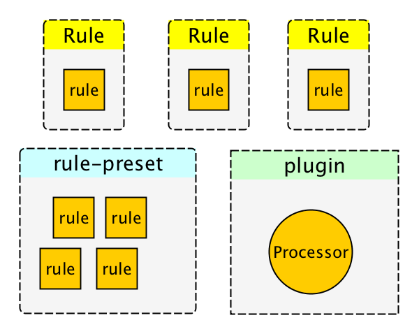

# textlint


<picture>
  <source media="(prefers-color-scheme: dark)" srcset="https://textlint.github.io/media/banner/banner_710x256.png">
  <source media="(prefers-color-scheme: light)" srcset="https://textlint.github.io/media/logo/spaced/textlint-logo.png">
  
</picture>

> The pluggable linting tool for text and markdown.
textlint is similar to [ESLint](http://eslint.org/ "ESLint"), but it's for use with natural language.

<!-- textlint-disable -->

[](https://github.com/textlint/textlint/actions?workflow=CI)

<!-- textlint-enable -->

## Website

- Online demo
- Searchable documents
- Release blog

Visit [https://textlint.github.io/](https://textlint.github.io/).

## Features

- No bundled rules.
- To use a rule, install a textlint rule via npm.
    - `npm install textlint-rule-xxx`.
    - See [collection of textlint rules](https://github.com/textlint/textlint/wiki/Collection-of-textlint-rule "Collection of textlint rule · textlint/textlint Wiki")
- [Markdown](./packages/@textlint/textlint-plugin-markdown) and [plain text](./packages/@textlint/textlint-plugin-text) are supported by default. Support is available for [HTML](https://github.com/textlint/textlint-plugin-html) and [other file formats](https://github.com/textlint/textlint#supported-file-formats) via plugins.
- Supports the use of custom formatters and formatter bundles [formatter(reporter)](./packages/@textlint/linter-formatter)

## Quick Tour

For a quick tour of textlint, checkout our [Getting Started](./docs/getting-started.md) guide :squirrel:

## Installation

You can install the `textlint` command using npm:

```
$ npm install textlint --save-dev
```

**Requirements**:

- Node.js 16+

If you're not sure what version of Node you're running, you can run `node -v` in your console to find out.

**:warning: Warning:**

- If you have installed `textlint` globally you must install each reference rule globally as well.
- If you have installed `textlint` locally you must install each rule locally as well.

We recommend installing `textlint` locally.

### For Node.js beginners

If you've never used Node.js and npm, please see the following:

- [Installing Node.js and updating npm | npm Documentation](https://docs.npmjs.com/getting-started/installing-node "02 - Installing Node.js and updating npm | npm Documentation")

## Usage


textlint has no default rules!!

You can run textlint with the `--rule` or `--rulesdir` flag to specify rules, or you can just use a `.textlintrc.json` config file.

```sh
# Install textlint's rule into local directory
npm install --save-dev textlint-rule-no-todo
```

Use with `textlint-rule-no-todo` rule.
(Allow to short `textlint-rule-no-todo` to `no-todo`)

```sh
npx textlint --rule no-todo README.md
```

:memo: We recommended using `.textlintrc.json` to specify rules instead of `--rule` or `--rulesdir` flags.
Your `.textlintrc.json` is a great way to maintain your rules.

## CLI

Run `npx textlint -h` for information on how to use the CLI.

```
$ textlint [options] file.md [file|dir|glob*]

Options:
  -h, --help                  Show help.
  -c, --config path::String   Use configuration from this file or sharable config.
  --ignore-path path::String  Specify path to a file containing patterns that describes files to ignore. - default: .textlintignore
  --init                      Create the config file if not existed. - default: false
  --fix                       Automatically fix problems
  --dry-run                   Enable dry-run mode for --fix. Only show result, don't change the file.
  --debug                     Outputs debugging information
  --print-config              Print the config object to stdout
  -v, --version               Outputs the version number.

Using stdin:
  --stdin                     Lint text provided on <STDIN>. - default: false
  --stdin-filename String     Specify filename to process STDIN as

Output:
  -o, --output-file path::String  Enable report to be written to a file.
  -f, --format String         Use a specific output format.

                              Available formatter          : checkstyle, compact, jslint-xml, json, junit, pretty-error, stylish, table, tap, unix

                              Available formatter for --fix: compats, diff, fixed-result, json, stylish - default: stylish
  --no-color                  Disable color in piped output.
  --quiet                     Report errors only. - default: false

Specifying rules and plugins:
  --no-textlintrc             Disable .textlintrc
  --plugin [String]           Set plugin package name
  --rule [String]             Set rule package name
  --preset [String]           Set preset package name and load rules from preset package.
  --rulesdir [path::String]   Use additional rules from this directory

Caching:
  --cache                     Only check changed files - default: false
  --cache-location path::String  Path to the cache file or directory - default: .textlintcache

Experimental:
  --experimental              Enable experimental flag.Some feature use on experimental.
  --rules-base-directory path::String  Set module base directory. textlint load modules(rules/presets/plugins) from the base directory.
  --parallel                  Lint files in parallel
  --max-concurrency Number    maxConcurrency for --parallel
```

When running texlint, you can target files to lint using the glob patterns.
Make sure that you enclose any glob parameter you pass in quotes.

```sh
$ npx textlint "docs/**"
```

For more details, see [CLI](./docs/cli.md) documentation.

- Documentation: [CLI](./docs/cli.md)

Example:

- :information_source: See [examples/cli](examples/cli)

## .textlintrc

`.textlintrc` is config file that is loaded as JSON, YAML or JS via [azu/rc-config-loader](https://github.com/azu/rc-config-loader).

Running textlint with the following arguments

```
$ npx textlint --rule no-todo --rule very-nice-rule README.md
```

is equivalent to running `textlint README.md` in a directory with a `.textlintrc.json` containing the following json

```json
{
  "rules": {
    "no-todo": true,
    "very-nice-rule": true
  }
}
```

You can also configure options for specific rules in your `.textlintrc.json` file.

```json
{
  "rules": {
    "no-todo": false, // disable
    "very-nice-rule": {
        "key": "value"
    }
  }
}
```

For example here we pass the options ("key": "value") to `very-nice-rule`.

Options can be specified in your `.textlintrc.json` file as follows:

<!-- textlint-disable -->

```js
{
  // Allow to comment in JSON
  "rules": {
    "<rule-name>": true | false | object
  }
}
```

<!-- textlint-enable -->

:information_source: for more details see

- [docs/configuring](docs/configuring.md)
- [examples/config-file](examples/config-file)

### Plugin

A textlint plugin is a set of rules and rulesConfig or customize parser.

To enable plugin, put the "plugin-name" into `.textlintrc.json`.

<!-- textlint-disable -->

```js
// `.textlintrc.json`
{
    "plugins": [
        "plugin-name"
    ],
    // overwrite-plugins rules config
    // <plugin>/<rule>
    "rules": {
        "plugin-name/rule-name" : false
    }
}
```

<!-- textlint-enable -->

:information_source: See [docs/plugin.md](docs/plugin.md)

### Supported file formats

textlint supports Markdown and plain text by default.

Install **Processor Plugin** and add new file format support.

For example, if you want to lint HTML, use [textlint-plugin-html](https://github.com/textlint/textlint-plugin-html "textlint-plugin-html") as a plugin.

    npm install textlint-plugin-html --save-dev

Add `"html"` to `.textlintrc.json`

```
{
    "plugins": [
        "html"
    ]
}
```

Run textlint on `.html` files:

  textlint index.html

- Example: [examples/html-plugin](examples/html-plugin)
- Documentation: [docs/plugin.md](docs/plugin.md)

Optional supported file types:

- HTML: [textlint-plugin-html](https://github.com/textlint/textlint-plugin-html "textlint-plugin-html")
- reStructuredText: [textlint-plugin-rst](https://github.com/jimo1001/textlint-plugin-rst "textlint-plugin-rst")
- AsciiDoc/Asciidoctor: [textlint-plugin-asciidoc-loose](https://github.com/azu/textlint-plugin-asciidoc-loose "textlint-plugin-asciidoc-loose")
- Re:VIEW: [textlint-plugin-review](https://github.com/orangain/textlint-plugin-review "textlint-plugin-review")
- Org-mode: [textlint-plugin-org](https://github.com/kijimaD/textlint-plugin-org "textlint-plugin-org")

See [Processor Plugin List](https://github.com/textlint/textlint/wiki/Collection-of-textlint-rule#processor-plugin-list "Processor Plugin List") for details.


### Rules list :green_heart:

textlint has not built-in rules, but there are 100+ pluggable rules:

- [textlint-rule-no-todo](https://github.com/textlint-rule/textlint-rule-no-todo)
- [textlint-rule-max-number-of-lines](https://github.com/azu/textlint-rule-max-number-of-lines)
- [textlint-rule-common-misspellings](https://github.com/io-monad/textlint-rule-common-misspellings)
- [etc...](https://github.com/textlint/textlint/wiki/Collection-of-textlint-rule)

See [A Collection of textlint rule · textlint/textlint Wiki](https://github.com/textlint/textlint/wiki/Collection-of-textlint-rule "Collection of textlint rule · textlint/textlint Wiki") for more details.


If you create a new rule, and add it to the wiki :)

### Fixable

[](https://textlint.github.io/)

Some rules are fixable using the `--fix` command line flag.

``` sh
$ npx textlint --fix README.md
# As a possible, textlint fix the content.
```


Also, support [dry run](https://en.wikipedia.org/wiki/Dry_run_(testing) "dry run") mode.

```
$ npx textlint --fix --dry-run --format diff README.md
# show the difference between fixed content and original content.
```

You can copy and paste to your README.

```markdown
[](https://textlint.github.io/)
```

### Built-in formatters

Use the following formatters:

- stylish (defaults)
- compact
- checkstyle
- jslint-xml
- junit
- tap
- table
- pretty-error
- json
- unix

e.g. use `pretty-error` formatter:

```
$ npx textlint -f pretty-error file.md
```

More details in [@textlint/linter-formatter](./packages/@textlint/linter-formatter "@textlint/linter-formatter").

## Use as node module

You can use textlint as node module.

```
$ npm install textlint --save-dev
```

Minimal usage:

```js
import { createLinter, loadTextlintrc, loadLinterFormatter } from "textlint";
const descriptor = await loadTextlintrc();
const linter = createLinter({ descriptor });
const results = await linter.lintFiles(["*.md"]);
// textlint has two types formatter sets for linter and fixer
const formatter = await loadLinterFormatter({ formatterName: "stylish" });
const output = formatter.format(results);
console.log(output);
```

More details info, please read the following documents:

- See [docs/use-as-modules.md](docs/use-as-modules.md)

[@textlint/kernel](./packages/@textlint/kernel "@textlint/kernel") is a low level API for textlint.
It is useful for the browser or non-Node.js environments.

```js
import { TextlintKernel } from "@textlint/kernel";
const kernel = new TextlintKernel();
const options = {
    filePath: "/path/to/file.md",
    ext: ".md",
    plugins: [
        {
            pluginId: "markdown",
            plugin: require("@textlint/textlint-plugin-markdown")
        }
    ],
    rules: [
        {
            ruleId: "no-todo",
            rule: require("textlint-rule-no-todo").default
        }
    ]
};
kernel.lintText("TODO: text", options).then(result => {
    assert.ok(typeof result.filePath === "string");
    assert.ok(result.messages.length === 1);
});
```


## Conclusion

textlint has four extensible points:

- [rule](docs/rule.md)
    - rule is a rule for linting.
- [filter rule](docs/filter-rule.md)
    - filter rule is a rule for filtering result of errors.
- [rule-preset](docs/rule-preset.md)
    - rule-preset contains rules.
- [plugin](docs/plugin.md)
    - plugin contains a processor.



## FAQ: How to create rules?

Please see docs/

- [docs/txtnode.md](docs/txtnode.md)
    - What is TxtNode?
- [docs/rule.md](docs/rule.md)
    - How to create rules?
    - Tutorial: creating `no-todo` rule.
- [docs/rule-advanced.md](docs/rule-advanced.md)
    - Advanced tutorial for creating rule.

## FAQ: How to suppress error by comments like `<!-- textlint-disable -->`?

You can use filter rule like [textlint-filter-rule-comments](https://github.com/textlint/textlint-filter-rule-comments "textlint-filter-rule-comments").

Please see [Ignoring Text · textlint](https://textlint.github.io/docs/ignore.html) for more details.

## Integrations

For more details, see [integrations document](./docs/integrations.md).

### App

- [textlint-app](https://github.com/textlint/textlint-app "textlint-app")
  - Standalone cross platform app. No need Node.js environment.

### Build Systems

- gulp plugin
  - [gulp-textlint](https://github.com/textlint/gulp-textlint "gulp-textlint")
- Grunt plugin
  - [grunt-textlint](https://github.com/textlint/grunt-textlint "grunt-textlint")

### Editors

- Atom Editor
  - [1000ch/linter-textlint](https://github.com/1000ch/linter-textlint "1000ch/linter-textlint")
- SublimeText
  - [joeybaker/sublimelinter-textlint](https://github.com/joeybaker/sublimelinter-textlint)
- Vim
  - [vim-textlint](https://github.com/heavenshell/vim-textlint "vim-textlint")
  - [scrooloose/syntastic](https://github.com/vim-syntastic/syntastic "scrooloose/syntastic")
    - See [Markdown](https://github.com/vim-syntastic/syntastic/wiki/Markdown "Markdown"), [Text](https://github.com/vim-syntastic/syntastic/wiki/Text "Text") and [HTML](https://github.com/vim-syntastic/syntastic/wiki/HTML "HTML") of [scrooloose/syntastic Wiki](https://github.com/vim-syntastic/syntastic/wiki/Syntax-Checkers "Syntax Checkers · scrooloose/syntastic Wiki")
- VS Code
  - [taichi/vscode-textlint](https://github.com/taichi/vscode-textlint)
- [micro](https://github.com/zyedidia/micro "micro")
  - [hidaruma/micro-textlint-plugin](https://github.com/hidaruma/micro-textlint-plugin "hidaruma/micro-textlint-plugin: textlint plugin for micro-editor")
- NetBeans
  - [netbeans-textlint-plugin](https://github.com/junichi11/netbeans-textlint-plugin "netbeans-textlint-plugin")

### Browser

- Chrome Extension
  - [Chrome: textlint-proofreader](https://chrome.google.com/webstore/detail/textlint-proofreader/hdongmdneapmhfblomidbafplpanpdmm)
  - [io-monad/textlint-chrome-extension: textlint Chrome Extension](https://github.com/io-monad/textlint-chrome-extension "io-monad/textlint-chrome-extension: textlint Chrome Extension")

### Other

- [Pronto](https://github.com/prontolabs/pronto "Pronto"): [pronto-textlint](https://github.com/seikichi/pronto-textlint "pronto-textlint")
- [reviewdog](https://github.com/reviewdog/reviewdog "reviewdog"): [azu/textlint-reviewdog-example](https://github.com/azu/textlint-reviewdog-example "azu/textlint-reviewdog-example: textlint + reviewdog example project")

## Who's using textlint?

- [survivejs/webpack-book](https://github.com/survivejs/webpack-book "survivejs/webpack-book: From apprentice to master (CC BY-NC-ND)")
- [hoodiehq/hoodie](https://github.com/hoodiehq/hoodie "hoodiehq/hoodie")
- [asciidwango/js-primer](https://github.com/asciidwango/js-primer "asciidwango/js-primer: JavaScriptの入門書")
- [vuejs-jp/vuejs.org](https://github.com/vuejs-jp/jp.vuejs.org "vuejs-jp/vuejs.org")
- [cypress-io/cypress-documentation](https://github.com/cypress-io/cypress-documentation "cypress-io/cypress-documentation: Cypress Documentation including Guides, API, Plugins, Examples, & FAQ. docs.cypress.io")

## Packages

This repository is a monorepo that we manage using [Lerna](https://github.com/lerna/lerna). That means that we actually publish [several packages](./packages) to npm from the same codebase, including:

### Core

These modules are parts of textlint.

| Package                                  | Version                                  | Description                              |
| :--------------------------------------- | :--------------------------------------- | :--------------------------------------- |
| [`textlint`](./packages/textlint)        | [](https://www.npmjs.com/package/textlint) | textlint command line tool itself        |
| [`@textlint/kernel`](./packages/@textlint/kernel) | [](https://www.npmjs.com/package/@textlint/kernel) | textlint main logic module. It is universal JavaScript. |
| [`@textlint/linter-formatter`](./packages/@textlint/linter-formatter) | [](https://www.npmjs.com/package/@textlint/linter-formatter) | textlint output formatter                |
| [`@textlint/fixer-formatter`](./packages/@textlint/fixer-formatter) | [](https://www.npmjs.com/package/@textlint/fixer-formatter) | textlint output formatter for fixer      |
| [`@textlint/textlint-plugin-markdown`](./packages/@textlint/textlint-plugin-markdown) | [](https://www.npmjs.com/package/@textlint/textlint-plugin-markdown) | markdown support for textlint            |
| [`@textlint/textlint-plugin-text`](./packages/@textlint/textlint-plugin-text) | [](https://www.npmjs.com/package/@textlint/textlint-plugin-text) | plain text support for textlint          |
| [`@textlint/ast-tester`](./packages/@textlint/ast-tester) | [](https://www.npmjs.com/package/@textlint/ast-tester) | Compliance tests for textlint's AST      |
| [`@textlint/markdown-to-ast`](./packages/@textlint/markdown-to-ast) | [](https://www.npmjs.com/package/@textlint/markdown-to-ast) | markdown parser                          |
| [`@textlint/ast-traverse`](./packages/@textlint/ast-traverse) | [](https://www.npmjs.com/package/@textlint/ast-traverse) | TxtNode traverse library                 |
| [`@textlint/text-to-ast`](./packages/@textlint/text-to-ast)    | [](https://www.npmjs.com/package/@textlint/text-to-ast) | plain text parser                        |


### Rule/Plugin helper

These modules are useful for textlint rule/plugin author.

| Package                                  | Version                                  | Description                              |
| :--------------------------------------- | :--------------------------------------- | :--------------------------------------- |
| [`@textlint/ast-node-types`](./packages/@textlint/ast-node-types) | [](https://www.npmjs.com/package/@textlint/ast-node-types) | [textlint AST(Abstract Syntax Tree)](./docs/txtnode.md) type definition |
| [`textlint-tester`](./packages/textlint-tester) | [](https://www.npmjs.com/package/textlint-tester) | textlint rule testing tools              |
| [`textlint-scripts`](https://github.com/textlint/textlint-scripts) | [](https://www.npmjs.com/package/textlint-scripts) | textlint rule npm run-scripts            |
| [`create-textlint-rule`](https://github.com/textlint/create-textlint-rule) | [](https://www.npmjs.com/package/create-textlint-rule) | create textlint rule with no build configuration |


### Integrations

These modules are useful integration with textlint.

| Package                                  | Version                                  | Description              |
| :--------------------------------------- | :--------------------------------------- | :----------------------- |
| [`gulp-textlint`](./packages/gulp-textlint) | [](https://www.npmjs.com/package/gulp-textlint) | gulp plugin for textlint |


### Internal

These modules are internal usage in the monorepo.

| Package                                  | Version                                  | Description          |
| :--------------------------------------- | :--------------------------------------- | :------------------- |
| [`@textlint/feature-flag`](./packages/@textlint/feature-flag) | [](https://www.npmjs.com/package/@textlint/feature-flag) | feature flag manager |


## Semantic Versioning Policy

textlint project follow [Semantic Versioning](https://semver.org/ "Semantic Versioning").
However, textlint is not different with most semver project.

- Patch release (intended to not break your lint build)
    - A bug fix to the CLI or core (including formatters).
    - Improvements to documentation.
    - Non-user-facing changes such as refactoring.
    - Re-releasing after a failed release (i.e., publishing a release that doesn't work for anyone).
- Minor release (might break your lint build)
    - A new option.
    - An existing rule is deprecated.
    - A new CLI capability is created.
    - New public API are added (new classes, new methods, new arguments to existing methods, etc.).
        - It might break type interface(`.d.ts`)
    - A new formatter is created.
- Major release (break your lint build)
    - A new option to an existing rule that results in textlint reporting more errors by default.
    - An existing formatter is removed.
    - Part of the public API is removed or changed in an incompatible way.

## Contributing

For bugs and feature requests, [please create an issue](https://github.com/textlint/textlint/issues).

Pull requests is always welcome.

For more details, see [Contributing Guide](docs/CONTRIBUTING.md).

## License

MIT © azu

Copy some code from ESLint.

    ESLint
    Copyright (c) 2013 Nicholas C. Zakas. All rights reserved.
    https://github.com/eslint/eslint/blob/master/LICENSE

## Logos & Icons

Download from [textlint/media](https://github.com/textlint/media "textlint/media: Official logo and icon.").

## Related Work

<!-- textlint-disable -->

- [SCG: TextLint](http://scg.unibe.ch/research/textlint "SCG: TextLint")

## Acknowledgements

Thanks to [ESLint](https://eslint.org/ "ESLint").

textlint website is powered by [Netlify](https://www.netlify.com).

<a href="https://www.netlify.com">
  
</a>

<!-- textlint-enable -->
