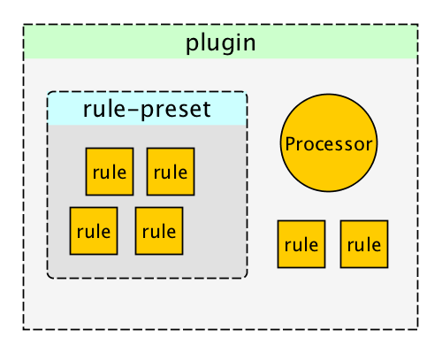

[](http://textlint.github.io/)

> The pluggable linting tool for text and markdown.  
> It is similar to [ESLint](http://eslint.org/ "ESLint"), but textlint for natural language.

[](https://travis-ci.org/textlint/textlint)

## Online Demo

Visit [http://textlint.github.io/](http://textlint.github.io/) and type text!

## Features

- No bundle rules.
- To use rule, run simply `npm install textlint-rule-xxx`. See a [collection of textlint rules](https://github.com/textlint/textlint/wiki/Collection-of-textlint-rule "Collection of textlint rule · textlint/textlint Wiki")
- [Markdown](https://github.com/textlint/textlint-plugin-markdown) and [plain text](https://github.com/textlint/textlint-plugin-text ) are support by default. Additionally, [HTML](https://github.com/textlint/textlint-plugin-html) and other formats are supported by plugins.
- [Formatter(reporter)](https://github.com/textlint/textlint-formatter) is used both by bundled and custom formatters

## Installation

```
$ npm install textlint -g
```

## Usage


- [ ]  more more document

textlint has no default rule!!

Use textlint with `--rule` or `--ruledir`, `.textlintrc` config file.

```sh
# Install textlint's rule
npm install --save-dev textlint-rule-no-todo
```

Use with `textlint-rule-no-todo` rule.
(allow to short `textlint-rule-no-todo` to `no-todo`)

```sh
textlint --rule no-todo README.md
```

## CLI

See command help.

```
$ textlint -h
  textlint [options] file.md [file.txt] [dir]
  
  Options:
    -h, --help                 Show help.
    -c, --config path::String  Use configuration from this file or sharable config.
    --plugin [String]          Specify plugins
    --rule [path::String]      Set rule package name
    --preset [path::String]    Set preset package name and load rules from preset package.
    --rulesdir [path::String]  Set rules from this directory and set all default rules to off.
    -f, --format String        Use a specific output format.
    -v, --version              Outputs the version number.
    --ext [String]             Specify text file extensions.
    --no-color                 Disable color in piped output.
    -o, --output-file path::String  Enable report to be written to a file.
    --quiet                    Report errors only. - default: false
    --stdin                    Lint code provided on <STDIN>. - default: false
```

Allow to use with multiple rules.

```sh
$ textlint --rule no-todo --rule very-nice-rule README.md
```

Example:

- :information_source: See [examples/cli](examples/cli)

### .textlintrc

`.textlintrc` is config file that is loaded as JSON, YAML or JS via [MoOx/rc-loader](https://github.com/MoOx/rc-loader "MoOx/rc-loader").

```
$ textlint --rule no-todo --rule very-nice-rule README.md
```

is equal to create `.textlintrc` file

```json
{
  "rules": {
    "no-todo": true,
    "very-nice-rule": true,
  }
}
```

and run `textlint` command

```sh
$ textlint README.md
# Automatically load `.textlintrc` in current directory
```

`.textlintrc` can define rule's option.

```json
{
  "rules": {
    "no-todo": false, // disable
    "very-nice-rule": {
        "key": "value"
    }
  }
}
```

Pass rule's options("key": "value") to `very-nice-rule`.

It mean that use the following format:

```js
{
  // Allow to comment in JSON
  "rules": {
    "<rule-name>": true | false | object
  }
}
```

:information_source: for more details

- [docs/configuring](docs/configuring.md)
- [examples/config-file](examples/config-file)

### Plugin

textlint plugin is a set of rules and rulesConfig or customize parser.

To enable plugin, put the "plugin-name" into `.textlinrc`.

```js
// `.textlinrc`
{
    "plugins": [
        "plugin-name"
    ],
    // overwrite-plugins rules config
    // <plugin>/<rule>
    "rules": {
        "plugin-name/rule-name" : false
    }
}
```

:information_source: See [docs/plugin.md](docs/plugin.md)

#### Processor Plugin

Processor Plugin add new file format support.
If you want to use textlint for HTML, use [textlint-plugin-html](https://github.com/textlint/textlint-plugin-html "textlint-plugin-html") as plugin.

    npm install textlint-plugin-html
    
and Add "html" to `.textlintrc`

```
{
    "plugins": [
        "html"
    ]
}
```

Run textlint and work!

- Example : [examples/html-plugin](examples/html-plugin)
- Document: [docs/plugin.md](docs/plugin.md)

### Rule list - [Collection of textlint rule](https://github.com/textlint/textlint/wiki/Collection-of-textlint-rule "Collection of textlint rule · textlint/textlint Wiki")

See [Collection of textlint rule · textlint/textlint Wiki](https://github.com/textlint/textlint/wiki/Collection-of-textlint-rule "Collection of textlint rule · textlint/textlint Wiki").

If you create new rule, and add it to the wiki :)

### Built-in formatters

Currently, you can use "stylish" (defaults), "compact", "checkstyle", "jslint-xml", "junit", "tap", "pretty-error", "json".

e.g.) use pretty-error.js

```
$ textlint -f pretty-error file.md
```

More detail in [textlint/textlint-formatter](https://github.com/textlint/textlint-formatter "textlint/textlint-formatter").

## Use as node modules

You can use textlint as node modules.

```
$ npm install textlint --save-dev
```

Minimal usage:

```js
import {TextLintEngine} from "textlint";
const engine = new TextLintEngine({
    rulePaths: ["path/to/rule-dir"]
});
engine.executeOnFiles(["README.md"]).then(results => {
    console.log(results[0].filePath);// => "README.md"
    // messages are `TextLintMessage` array.
    console.log(results[0].messages);
    /* 
    [
        {
            id: "rule-name",
            message:"lint message",
            line: 1, // 1-based columns(TextLintMessage)
            column:1 // 1-based columns(TextLintMessage)
        }
    ]
     */
    if (engine.isErrorResults(results)) {
        var output = engine.formatResults(results);
        console.log(output);
    }
});
```

Low level usage:

```js
import {textlint} from "textlint";
textlint.setupRules({
    // rule-key : rule function(see docs/rule.md)
    "rule-key": function(context){
        var exports = {};
        exports[context.Syntax.Str] = function (node) {
            context.report(node, new context.RuleError("error message"));
        };
        return exports;
    }
});
textlint.lintMarkdown("# title").then(results => {
    console.log(results[0].filePath);// => "README.md"
    console.log(results[0].messages);// => [{message:"lint message"}]
});
```

More detail on:

- See [docs/use-as-modules.md](docs/use-as-modules.md)


## Conclusion

textlint has three extensible points

- [rule](docs/rule.md)
    - rule is a rule for linting.
- [rule-preset](docs/rule-preset.md)
    - rule-preset contains rules.
- [plugin](docs/plugin.md)
    - plugin contains rules and a processor.



## FAQ: How to create rules?

Please see docs/

- [docs/txtnode.md](docs/txtnode.md)
    - What is is TxtNode?
- [docs/rule.md](docs/rule.md)
    - How to create rules?
    - Tutorial: creating `no-todo` rule.

## Use with XXX

- [nakajmg/gulp-textlint](https://github.com/textlint/gulp-textlint "nakajmg/gulp-textlint")

> gulp plugin for textlint.

- [1000ch/linter-textlint](https://github.com/1000ch/linter-textlint "1000ch/linter-textlint")

> The plugin for Atom Linter provides an interface to textlint.


## Who's using textlint?

- [vuejs-jp/vuejs.org](https://github.com/vuejs-jp/jp.vuejs.org "vuejs-jp/vuejs.org")

> The vuejs.org for japanese.

## Contributing

1. Fork it!
2. Create your feature branch: `git checkout -b my-new-feature`
3. Commit your changes: `git commit -am 'Add some feature'`
4. Push to the branch: `git push origin my-new-feature`
5. Submit a pull request :D

## License

MIT and

`lib/load-rules.js`, `util/traverse.js`, `cli.js` and `timing.js` are:

    ESLint
    Copyright (c) 2013 Nicholas C. Zakas. All rights reserved.
    https://github.com/eslint/eslint/blob/master/LICENSE

## Related Work

[SCG: TextLint](http://scg.unibe.ch/research/textlint "SCG: TextLint") is similar project.

[SCG: TextLint](http://scg.unibe.ch/research/textlint "SCG: TextLint")'s place is equal to my `textlint`(Fortuitously, project's name is the same too!).


via [Natural Language Checking with Program Checking Tools](http://www.slideshare.net/renggli/text-lint "Natural Language Checking with Program Checking Tools")

## Acknowledgements

Many thanks to [ESLint](http://eslint.org/ "ESLint").
