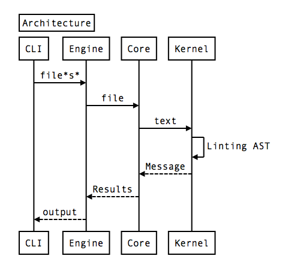

# Use as node modules

## Overview




`textlint` module expose these header at [index.js](../src/index.js)

```js
// Level of abstraction(descending order)
// cli > TextLintEngine > TextLintCore(textlint)
// See: https://github.com/textlint/textlint/blob/master/docs/use-as-modules.md
module.exports = {
    // Command line interface
    cli,
    // TextLintEngine is a wrapper around `textlint` for linting **multiple** files
    // include formatter, detecting utils
    // <Recommend>: It is easy to use
    // You can see engine/textlint-engine-core.js for more detail
    TextLintEngine,
    // TextFixEngine is a wrapper around `textlint` for linting **multiple** files
    // include formatter, detecting utils
    // <Recommend>: It is easy to use
    // You can see engine/textlint-engine-core.js for more detail
    TextFixEngine,
    // It is a singleton object of TextLintCore
    // Recommend: use TextLintCore
    textlint,
    // Core API for linting a **single** text or file.
    TextLintCore,
    // Constant Types
    TextLintMessageType: MessageType,
    TextLintMessageSeverityLevel: SeverityLevel,
    TextLintNodeType: TextLintNodeType,
};
```

Recommend to use `TextLintEngine`.

## Architecture

See [src/README.md](../src/README.md) for details.

### CLI(Command Line Interface)

CLI parse command arguments, and run Engine with the options.

### Engine

textlint has two engines `TextLintEngine` and `TextFixEngine`.

Both engine

- Load configuration from `.textlintrc`.
- Handle **multiple** files or text string.
- Return a array of `TextLintResult` or `TextLintFixResult`
    - actually, return a Promise like `Promise<TextLintResult[]>`

### Core

textlint's core 

- Accept configuration as object.
- Handle a **single** file or text string.
- Return `TextLintResult` or `TextLintFixResult`
    - actually, return a Promise like `Promise<TextLintResult>`

## Example

Lint files using `TextLintEngine`:

See [example/node-module/lint-file.js](example/node-module/lint-file.js)

```js
const TextLintEngine = require("textlint").TextLintEngine;
const path = require("path");
function lintFile(filePath) {
    /**
     * TextLintConfig
     * See https://github.com/textlint/textlint/blob/master/typings/textlint.d.ts
     */
    const options = {
        // load rules from [../rules]
        rulePaths: [path.join(__dirname, "..", "rules/")],
        formatterName: "pretty-error"
    };
    const engine = new TextLintEngine(options);
    const filePathList = [path.resolve(process.cwd(), filePath)];
    engine.executeOnFiles(filePathList).then(function(results){
        /* 
        See https://github.com/textlint/textlint/blob/master/typings/textlint.d.ts
        messages are TextLintMessage` array.
        [
            "filePath": "path/to/file",
            "messages" :[
                {
                    id: "rule-name",
                    message:"lint message",
                    line: 1, // 1-based columns(TextLintMessage)
                    column:1 // 1-based columns(TextLintMessage)
                }
            ]
        ]
         */
        if (engine.isErrorResults(results)) {
            const output = engine.formatResults(results);
            console.log(output);
        }
    }).catch(function(error){
        console.error(error);
    });
}
```

## Testing

You can use [textlint-tester](https://github.com/textlint/textlint-tester "textlint-tester") for testing your custom rule.

- [textlint-tester](https://github.com/textlint/textlint-tester "textlint-tester")
- [rule.md](./rule.md)

Consult link: [spellcheck-tech-word-textlint-rule/test.js at master · azu/spellcheck-tech-word-textlint-rule](https://github.com/azu/spellcheck-tech-word-textlint-rule/blob/master/test/test.js "spellcheck-tech-word-textlint-rule/test.js at master · azu/spellcheck-tech-word-textlint-rule")
