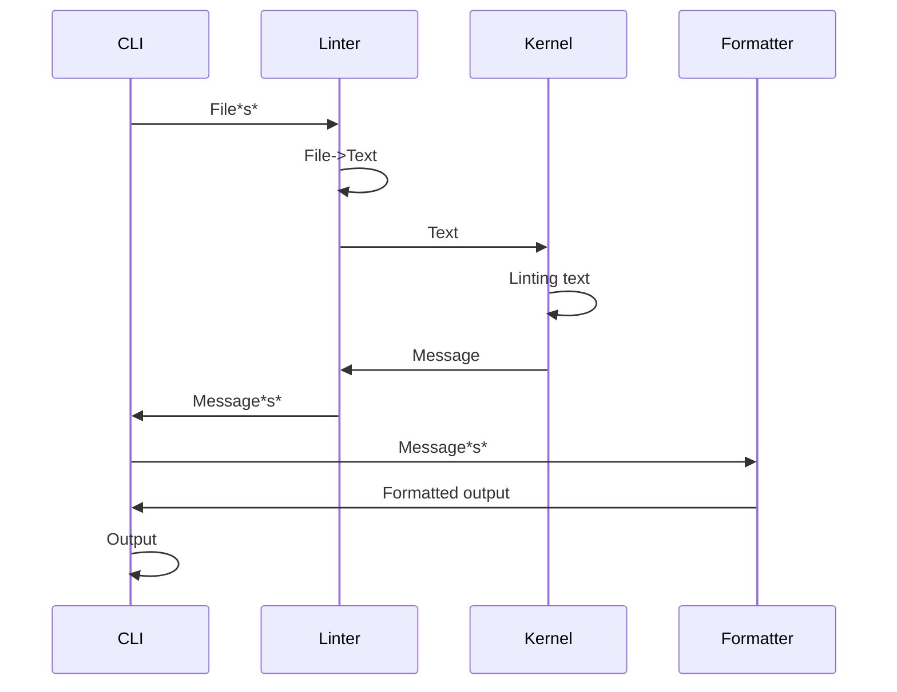

# Architecture

## Overview

- CLI know Linter
- Linter know Kernel
- Kernel does not depend on other modules
  - Kernel work on Browser/Node.js

textlint apply [Separation of Concern](http://weblogs.asp.net/arturtrosin/separation-of-concern-vs-single-responsibility-principle-soc-vs-srp).
